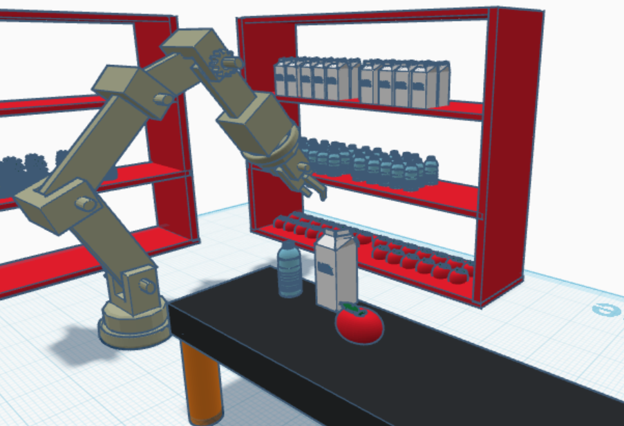
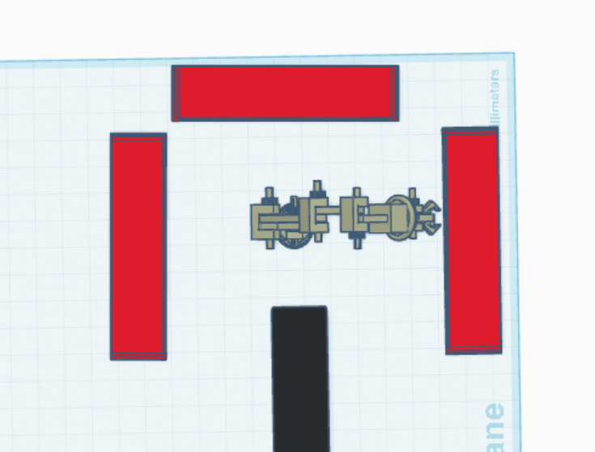
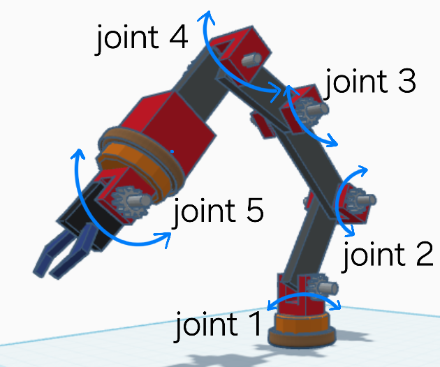
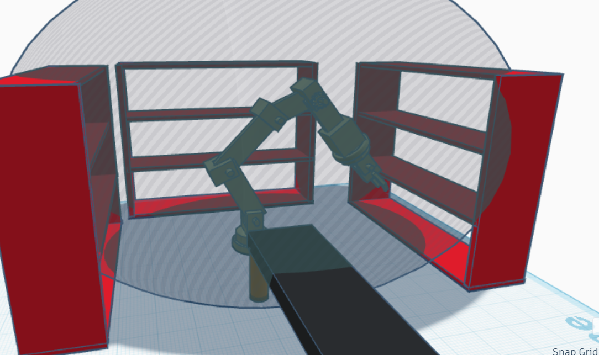

# 🤖 Robotic Food Warehouse System

## 📌 Project Description

This project is about designing and building a robotic system that automates the handling of food materials inside a warehouse **without any human intervention**. The robot is responsible for picking, sorting, and placing food items efficiently between storage shelves and an output box.

 
---

## 🎯 Project Objective

To develop an autonomous robotic arm that:
- Scans and identifies food items in shelves.
- Picks up items and places them on a central table.
- Moves the items to a designated output container.
- Operates within a fixed working environment.

---

## 🧠 Execution Algorithm

1. Start in the initial (home) position.
2. Scan the shelves for items.
3. Move to the item location.
4. Grab the item using the gripper.
5. Place the item on the working table for sorting/processing.
6. Transfer the item to the output box.
7. Repeat until all items are processed.

---

## 🤖 Robot Design

- **Type:** 5-DOF Industrial Robotic Arm
- **Mounted on:** Central workstation table
- **Functions:** Pick and place items across three shelves
- **Control:** Programmed to operate autonomously

---

## 🧱 Working Envelope Components

| Component     | Description                                  |
|---------------|----------------------------------------------|
| Robotic Arm   | Main automation tool for movement and pickup |
| Storage Shelves (x3) | Holds the food materials              |
| Central Table | Workspace for sorting and temporary placement|
| Output Box    | Final drop-off area for processed items      |

---

## 📦 Future Improvements

- Add sensors for object detection.
- Integrate with a conveyor system for dynamic input/output.
- Use AI for object classification and shelf organization.

---
## 🔄 Working Space and Dead Zone

### 🔹 Working Space (Envelope)
The working space is the reachable 3D area around the robotic arm where it can perform operations. In this design, it covers:
- All storage shelves
- The center table

### 🔸 Dead Zone
Dead zones are areas that the robot cannot access due to physical limitations or obstructions. In this system, dead zones include:
- Behind or above the tall shelves
- Corners outside the robot’s arm radius
- Areas beyond the robot’s base rotation limits

---
